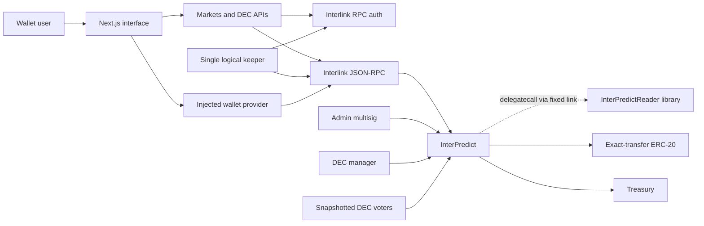
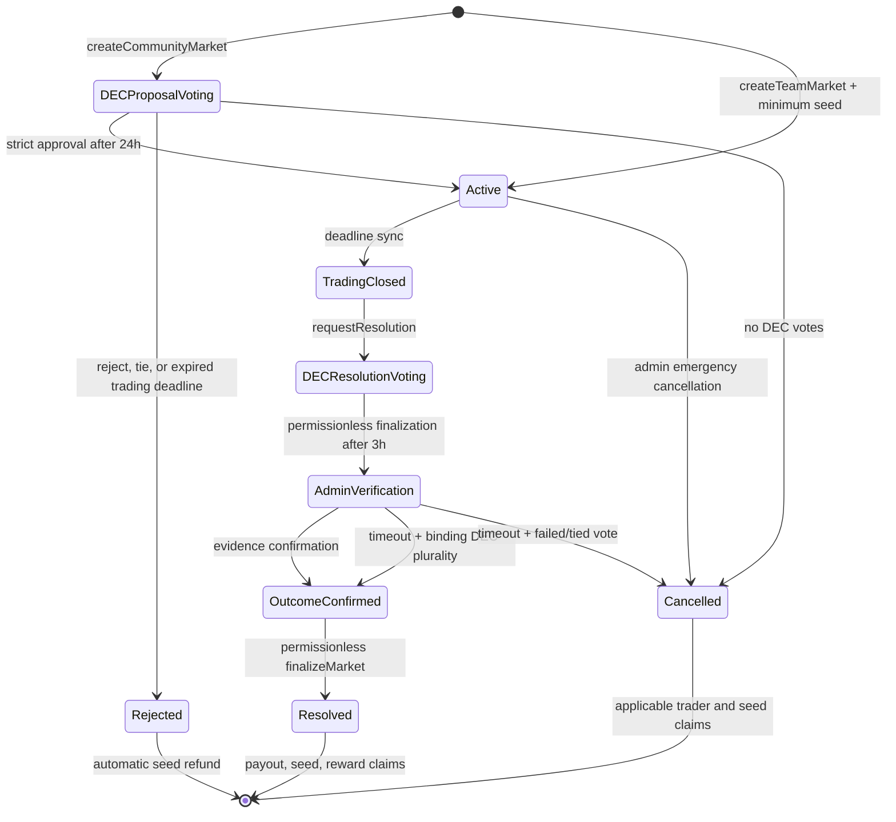
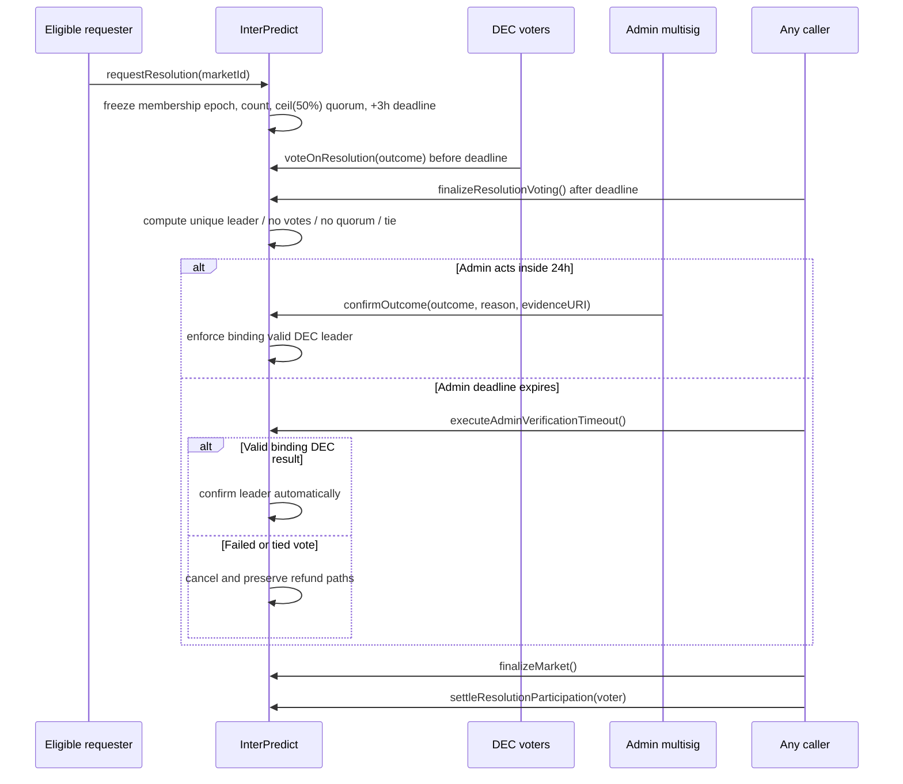
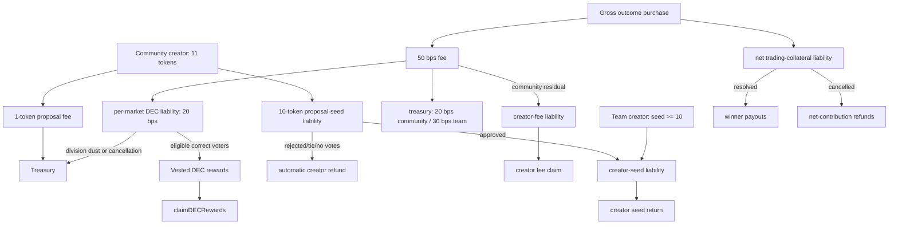
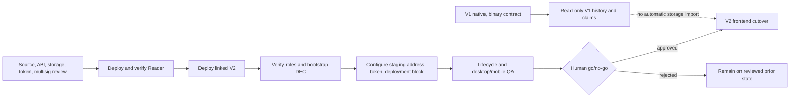

# InterPredict V2 Protocol Diagrams

These Mermaid diagrams describe the reviewed V2 architecture. The deployed
contract and verified source remain authoritative.

## Component topology

## Market lifecycle

## Resolution snapshot and timeout

## Asset and liability flow

## Breaking migration

